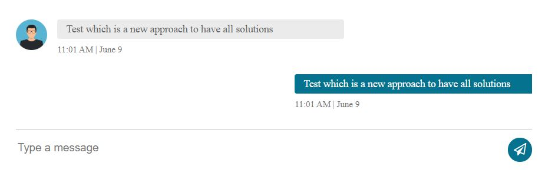
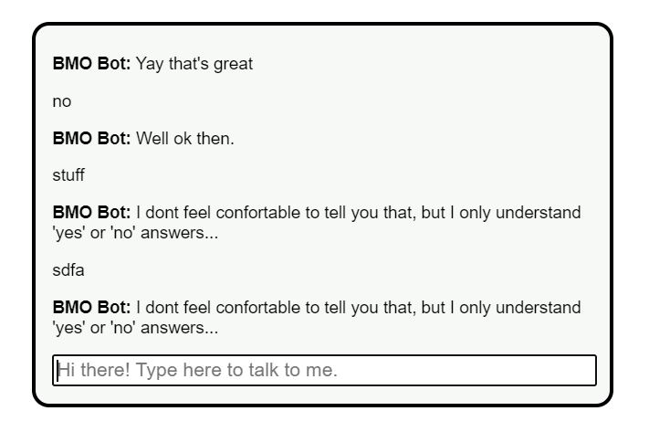
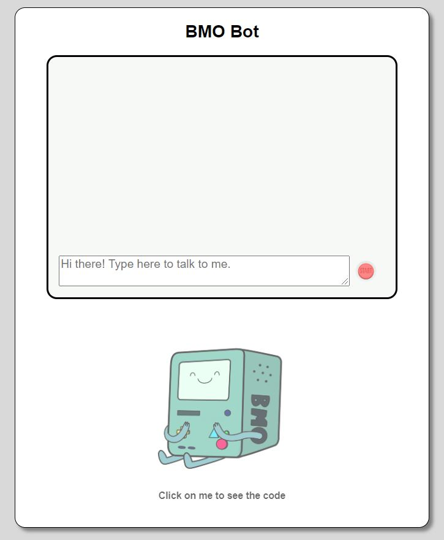
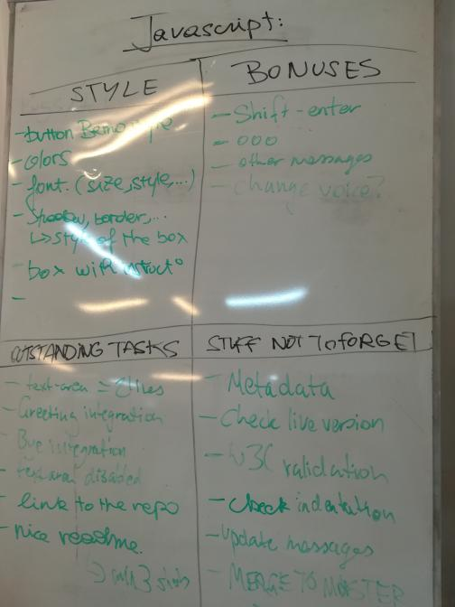

# Chatbot

[Click here for the live website](https://ashleightempleton.github.io/Javascript/)

## What

__A Chatbot__ to help reduce loneliness in the world, one word at a time. 

### Features

This chatbot features: 

#### Messaging

* Multiple random greetings;
* multiple responses to yes/no answers from the user;
* A message for when the user does not input a message the bot understands;
* A passive-agressive answer for when the user inputs 3 messages the bot does not understand;
* Goodbye message;

#### User Text input 

* Allowing the user to use the *submit button* or the *Enter key* to submit their response

#### Other

* Text to speech for each bot response
* Button to the GitHub repository 
* A friendly BMO to light up your day

### Future updates

* Shift-Enter to go to new line
* *In progress* animation
* More chat input options & bot responses
* Styling updates

### Concept

To begin, we chose the following UI as a concept to work with.
However, the HTML and CSS code was long and complicated with a lot of nested div tags, each with their own class and/or ID, which became confusing when doing an initial merge with the JavaScript file.

We then used a much simpler UI in which to fully test and to modify the JavaScript code before completing the styling.

After finalising the styling and any necessary changes, we completed the final product.

## Why

This project was a challenge posed by BeCode as part of the formation in Web Development. 
The project was developed to consolidate our knowledge of JS and its integration with HTML & CSS. 
With this we also continue our development in team work, project management, and git. 

## When

This project was created within three days from 15/07/2020 - 17/07/2020. 

* Day 1:
  * Defining the structure
  * Finding a UI
  * Establishing core code

* Day 2: 
  * Consolidation of code 
  * Verification of features and functionality
  * Establishing a list of potential bonus features 
 
* Day 3:
  * Finishing last coding edits
  * Ensuring all code is functioning well by the afternoon 
  * Cleaning code 
  * Finalising GitHub documents & readme for final submit

## How

The project was completed in a group of three persons who worked together at each phase to complete the project. 
The team consistently updated the whiteboard featured below with necessary tasks as the project progressed.

### Languages & tools

* HTML
* CSS
* JavaScript

### Resources

* [UI template](https://codepen.io/mrlapin/pen/rNxQBaz)
* [BMO image](https://www.pinterest.at/pin/103864335143891832/)
* [Text to Speech](http://eloquentjavascript.net/09_regexp.html)

## Who

* Ines Mathy
* Mathieu Herbos
* Ashleigh Templeton

